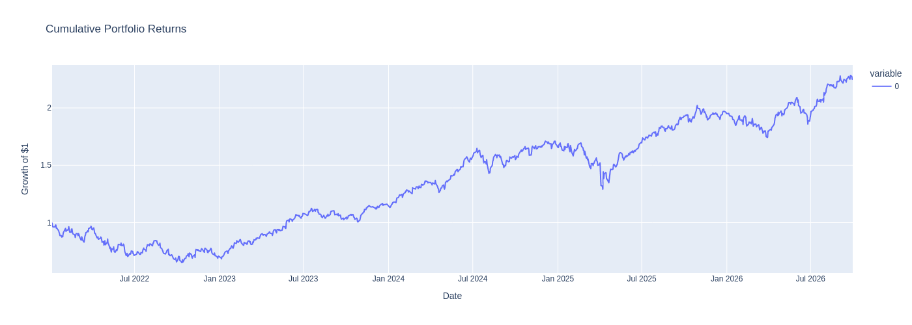
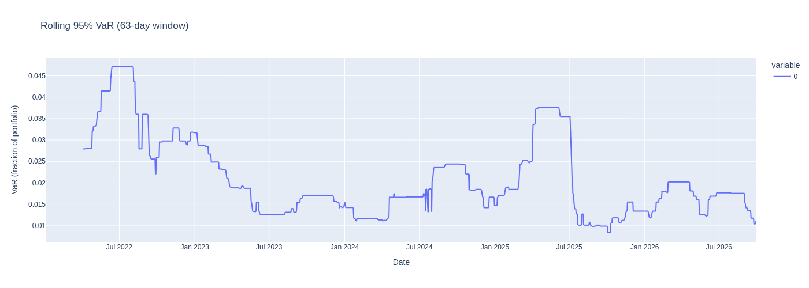
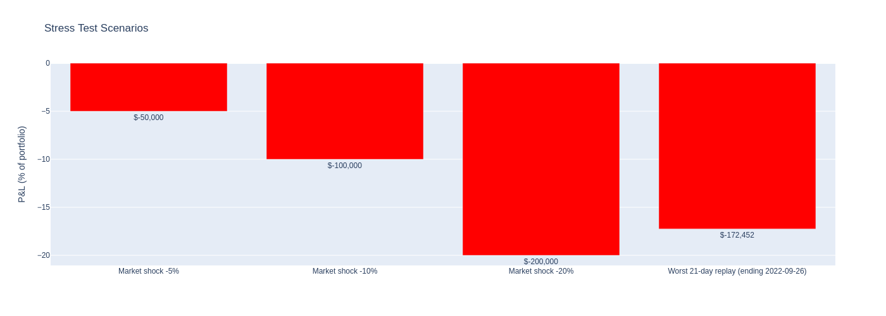
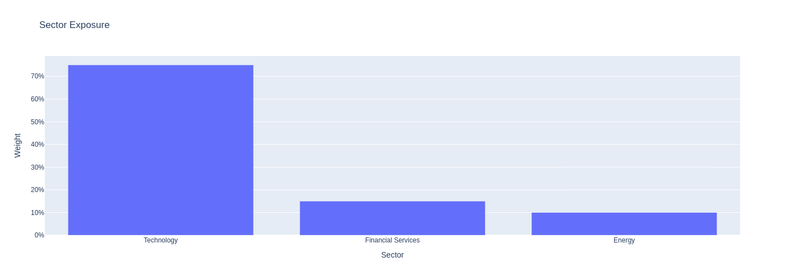

# Portfolio Risk Dashboard

An interactive portfolio risk analytics dashboard: build a custom equity portfolio, then measure its market risk with industry-standard metrics — VaR (three methods), Expected Shortfall, rolling risk, drawdowns, correlation structure, stress scenarios, VaR backtesting, and sector exposure.

Built with **Python · Streamlit · yfinance · Plotly**.

## Dashboard Tabs

| Tab | What it shows |
|---|---|
| Overview | Cumulative portfolio returns, drawdown chart, KPI cards (VaR, CVaR, vol, Sharpe, max drawdown) |
| Risk Metrics | Parametric vs Monte Carlo VaR comparison, rolling 63-day VaR, asset correlation heatmap |
| Stress Testing | -5% / -10% / -20% market shocks, worst 21-day in-sample replay, custom shock slider |
| Backtesting | Kupiec proportion-of-failures test on the rolling VaR model (LR statistic + p-value) |
| Sector Exposure | Portfolio weights aggregated by GICS sector |

## Screenshots

Default demo portfolio: AAPL / MSFT / NVDA / JPM / XOM (2022–present, 95% VaR).






## Quickstart

```bash
git clone https://github.com/zongmaow/portfolio-risk-dashboard.git
cd portfolio-risk-dashboard
pip install -r requirements.txt
streamlit run app.py
```

Then open the local URL Streamlit prints, enter tickers and weights in the sidebar, and click **Run analysis**.

Run the test suite (synthetic data, no network needed):

```bash
python -m unittest discover tests
```

## Methodology

- **Returns**: log returns from adjusted-close prices (yfinance).
- **VaR** reported as a positive loss number at the chosen confidence level:
  - *Historical simulation* — empirical quantile of the return distribution.
  - *Parametric* — normal assumption, μ + σ·z.
  - *Monte Carlo* — 10,000 simulated one-day returns from the fitted normal.
- **CVaR / Expected Shortfall** — mean loss conditional on breaching VaR.
- **Stress tests** — hypothetical uniform shocks plus a historical replay: the worst 21-day cumulative loss observed in-sample, re-applied as "what if it happened again".
- **Backtesting** — Kupiec POF test: H₀ is that the observed violation rate equals 1 − confidence. A rejection flags a mismatch worth investigating (regime change, fat tails, window choice), not an automatic model invalidation.

## Assumptions and Limitations

| Assumption | Where it lives | What it implies |
|---|---|---|
| Log returns are ~normal (parametric / MC VaR) | `src/risk_metrics.py` | Understates tail risk for fat-tailed assets; historical VaR does not make this assumption |
| 252 trading days per year | `src/risk_metrics.py` | Annualized vol/Sharpe scale with √252 |
| Weights normalized to 1, no leverage | `src/risk_metrics.py` | Long-only, fully invested portfolio |
| Uniform shock hits all assets equally | `src/stress_testing.py` | Ignores beta differences across holdings |
| Sector via yfinance info, static fallback | `src/data.py` | Sector for exotic tickers may show as "Unknown" |
| Survivorship-free data not guaranteed | `src/data.py` | Delisted tickers simply have no price history |

## Project Structure

```
portfolio-risk-dashboard/
├── app.py                  # Streamlit app (sidebar config + 5 tabs)
├── src/
│   ├── data.py             # yfinance price download, sector lookup
│   ├── risk_metrics.py     # VaR / CVaR / drawdown / Sharpe / Kupiec (pure functions)
│   ├── stress_testing.py   # hypothetical shocks + historical replay
│   └── plotting.py         # Plotly chart helpers
├── tests/
│   └── test_risk_metrics.py  # unit tests on synthetic data
└── requirements.txt
```

Core logic is deliberately kept as pure functions (no Streamlit, no I/O) so it can be unit-tested and reused in scripts.

## What I Learned

- Annualization is a silent bug factory: mixing daily and annualized units in one formula produces plausible-looking but wrong numbers — the unit tests pin these down.
- Reporting a backtest *rejection* honestly is more credible than tuning the window until H₀ passes.
- Streamlit caching belongs at the app layer (`data.py` stays framework-free), otherwise tests import UI code.

## Disclaimer

Educational project. Not investment advice. Market data via Yahoo Finance may be delayed or inaccurate.

## Author

**Zongmao Wu, CFA** — MS Financial Engineering, USC · [LinkedIn](https://www.linkedin.com/in/zongmaow/)
