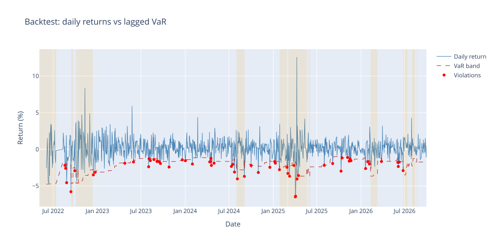

# Portfolio Risk Dashboard

Equity portfolio VaR, stress tests, and a simple volatility-regime backtest.

A Streamlit dashboard for market risk on a custom equity portfolio. It computes VaR and Expected Shortfall three ways, runs stress scenarios, and backtests the VaR — including a version conditioned on the volatility regime.

Built with **Python · Streamlit · yfinance · Plotly**.

## Dashboard Tabs

| Tab | What it shows |
|---|---|
| Overview | Cumulative portfolio returns, drawdown chart, KPI cards (VaR, CVaR, vol, Sharpe, max drawdown) |
| Risk Metrics | VaR / Expected Shortfall comparison across three models (historical, normal parametric, Student-t Monte Carlo), rolling 63-day VaR, asset correlation heatmap |
| Stress Testing | -5% / -10% / -20% market shocks, worst 21-day in-sample replay, custom shock slider, single-factor (SPY beta) shock |
| Backtesting | Kupiec POF + Christoffersen independence tests on the lagged rolling VaR model, violation timeline, and a **regime-aware VaR** comparison (high/low volatility regimes with shaded bands) |
| Sector Exposure | Portfolio weights aggregated by GICS sector |

## Screenshots

Default demo portfolio: AAPL / MSFT / NVDA / JPM / XOM (2022–present, 95% VaR).





## Quickstart

```bash
git clone https://github.com/zongmaow/portfolio-risk-dashboard.git
cd portfolio-risk-dashboard
pip install -r requirements.txt
streamlit run app.py
```

Then open the local URL Streamlit prints, enter tickers and weights in the sidebar, and click **Run analysis**.

Run the test suite (synthetic data, no network needed):

```bash
python -m unittest discover tests
```

## Methodology

- **Returns**: simple (arithmetic) daily returns from adjusted-close prices (yfinance). Arithmetic returns are exact under portfolio weighting and compound correctly with `(1 + r).cumprod()`.
- **VaR** reported as a positive loss number at the chosen confidence level:
  - *Historical simulation* — empirical quantile of the return distribution.
  - *Parametric* — normal assumption, μ + σ·z.
  - *Monte Carlo (Student-t)* — 10,000 simulated one-day returns from a Student-t fitted to the data, capturing fat tails the normal model misses.
- **CVaR / Expected Shortfall** — mean loss conditional on breaching VaR, computed for all three models (historical, normal closed form, Student-t Monte Carlo).
- **Stress tests** — hypothetical uniform shocks, a single-factor shock using each asset's SPY beta, plus a historical replay: the worst 21-day cumulative loss observed in-sample, re-applied as "what if it happened again".
- **Backtesting** — Kupiec POF test plus Christoffersen independence test. The VaR series is **lagged by one day**: day-t returns are tested against VaR estimated on data up to t-1, so there is no look-ahead. H₀ is that the observed violation rate equals 1 − confidence and violations do not cluster. A rejection usually points at regime change, fat tails, or window choice.
- **Regime-aware VaR** — each day is classified into a high/low volatility regime from its trailing 21-day realized vol vs. the expanding median (both lagged, so no look-ahead). VaR is then estimated only from past days in the *same* regime, so the band widens automatically when volatility clusters. It is a diagnostic check, not a forecasting model.

## Assumptions and Limitations

| Assumption | What it implies |
|---|---|
| Simple returns throughout | Exact under weighting; no log/arithmetic mixing |
| Backtest uses lagged VaR (t−1) | No look-ahead: estimation window excludes the tested day |
| Volatility regime is a simple vol proxy | Trailing 21d vol vs expanding median, both lagged; not a fitted HMM — regimes are descriptive, not structural |
| Simple returns are ~normal (parametric VaR) | Understates tail risk for fat-tailed assets; historical VaR and Student-t MC do not make this assumption |
| 252 trading days per year | Annualized vol/Sharpe scale with √252 |
| Weights normalized to 1, no leverage | Long-only, fully invested portfolio |
| Uniform shock hits all assets equally | Ignores beta differences across holdings; the SPY-beta shock is the structured alternative |
| Sector via yfinance info, static fallback | Sector for exotic tickers may show as "Unknown" |
| Survivorship-free data not guaranteed | Delisted tickers simply have no price history |

## Project Structure

```
portfolio-risk-dashboard/
├── app.py                  # Streamlit app (sidebar config + 5 tabs)
├── src/
│   ├── data.py             # yfinance price download, sector lookup
│   ├── risk_metrics.py     # VaR / CVaR / drawdown / Sharpe / Kupiec (pure functions)
│   ├── stress_testing.py   # hypothetical shocks + historical replay
│   └── plotting.py         # Plotly chart helpers
├── tests/
│   └── test_risk_metrics.py  # unit tests on synthetic data
└── requirements.txt
```

Core logic is deliberately kept as pure functions (no Streamlit, no I/O) so it can be unit-tested and reused in scripts.

## What I Learned

- Mixing daily returns with annualized volatility in one formula gives numbers that look right and aren't. The unit tests now pin the √252 scaling so it stays fixed.
- Streamlit caching belongs at the app layer (`data.py` stays framework-free), otherwise tests end up importing UI code.

## Disclaimer

Educational project. Not investment advice. Market data via Yahoo Finance may be delayed or inaccurate.

## Author

**Zongmao Wu, CFA** — MS Financial Engineering, USC · [LinkedIn](https://www.linkedin.com/in/zongmaow/)
